# BrightSync


Mirror the built-in display brightness of an Apple Silicon Mac to external
displays over DDC/CI.

> **Beta**: BrightSync is pre-1.0. Backward compatibility is not guaranteed
> until version 1.0.0 is reached.

Change brightness with the keyboard, Control Center, or let the ambient light
sensor do it - every connected DDC-capable external display follows
immediately. A small menu bar app, no polling: it receives the same
notification the system UI uses and pushes the mapped luminance straight to
the display over I2C. Settings live behind the sun icon in the menu bar
(which you can hide); changes apply immediately.

Clamshell mode is covered too: with the lid closed the daemon handles the
brightness keys itself and shows a brightness overlay, so the keys keep
working exactly as they do on the built-in display (see
[Clamshell mode](#clamshell-mode)).

<p align="center">
  <picture>
    <source media="(prefers-color-scheme: dark)" srcset="Resources/images/how-it-works-dark.svg">
    
  </picture>
</p>

## Install

```sh
brew install --cask pszypowicz/tap/bright-sync
```

Or grab the `.dmg` from the
[latest release](https://github.com/pszypowicz/BrightSync/releases/latest)
and drag BrightSync into Applications.

Either way, the app enables launch at login on its first run (visible under
System Settings > General > Login Items & Extensions; toggle it any time in
Settings). Grant it Accessibility when prompted so the clamshell brightness
keys work.

To build and install from source instead:

```sh
scripts/install-app.sh
```

This signs with a "Developer ID Application" identity from your keychain;
pass `--sign <substring>` to pick another certificate, or `--sign adhoc`
for an unsigned build.

The app executable doubles as the `brightsync` command. A Homebrew install
puts it on your PATH for you (and `brew uninstall` takes it away again). If
you dragged the app in from the DMG instead, open Settings (menu bar icon >
Settings…) and use **Command-Line Tool > Install** - it symlinks
`brightsync` into `/opt/homebrew/bin` or `~/.local/bin`, so no `sudo`. The
same button removes it.

The daemon logs to the unified log:

```sh
log stream --predicate 'subsystem == "cz.szypowi.brightsync"'
```

Run `brightsync --verbose` in a terminal instead if you want to watch it
work.

## Usage

```
brightsync                     run the menu bar app in the foreground
brightsync --list              show displays and current values, then exit
brightsync --once              sync once and exit
brightsync --set-external 40   write luminance percent (0-100) to all
                               external displays and exit; the next
                               brightness change re-syncs over it
brightsync --help              all flags
```

Opening the app while it is already running shows the Settings window - the
escape hatch when the menu bar icon is hidden.

## Configuration

The Settings window (menu bar icon > Settings…) covers launch at login,
hiding the menu bar icon, clamshell brightness keys, and the brightness
mapping curve. It is a plain view over the `cz.szypowi.brightsync` defaults
domain, so scripting works the same way and changes apply immediately, no
restart needed:

```sh
defaults write cz.szypowi.brightsync min -float 10
defaults write cz.szypowi.brightsync gamma -float 1.4
```

Inspect with `defaults read cz.szypowi.brightsync`, reset a key with
`defaults delete cz.szypowi.brightsync <key>`. The keys:

- `min` / `max` (`-float`) - external luminance range (0-100) mapped to
  internal brightness 0..1. Raise `min` if the external display gets too
  dark at the low end.
- `gamma` (`-float`) - curve exponent applied to the internal brightness
  before mapping. Values above 1 keep the external display dimmer in the
  midrange; below 1 keep it brighter.
- `intervalMs` (`-int`) - minimum gap between DDC writes. Brightness changes
  arrive in bursts (macOS ramps smoothly), so writes are coalesced to the
  most recent value at this rate. Raise it if your display is flaky under
  rapid DDC traffic. No UI - defaults only.
- `clamshellKeys` (`-bool`) - handle the brightness keys while the lid is
  closed (default `true`, see [Clamshell mode](#clamshell-mode)).
- `showMenuBarIcon` (`-bool`) - show the sun icon in the menu bar (default
  `true`).

## Clamshell mode

With the lid closed the built-in panel goes offline and macOS ignores the
brightness keys. The daemon covers this itself - an event tap picks up the
brightness keys, steps
a virtual brightness through the same mapping curve, writes it to the
external displays, and shows a short-lived overlay: a sun icon that
distinguishes brightening from darkening plus the luminance percentage,
drawn with Liquid Glass on macOS 26. Option+Shift+key gives fine quarter
steps, matching the built-in display. Opening the lid hands the keys
straight back to macOS.

- Requires the Accessibility permission (System Settings > Privacy &
  Security > Accessibility). The daemon prompts on first start and picks the
  grant up the moment it is made; everything else works without it.
- When building from source, sign with a stable identity (the default
  Developer ID, or a self-signed code-signing certificate) - macOS ties the
  Accessibility grant to the signature, so ad-hoc rebuilds have to be
  re-approved every time.
- If a display macOS controls natively is online (Apple Studio Display, Pro
  Display XDR), key presses are passed through even in clamshell so native
  control keeps working.
- The starting value is the last brightness seen before the lid closed; when
  the daemon starts already in clamshell it is derived from the luminance
  the display reports.

## Requirements and limitations

- Apple Silicon and macOS 26 or newer. The DDC transport used here is the
  Apple DCP I2C service; Intel Macs need a different mechanism (see
  [ddcctl](https://github.com/kfix/ddcctl)).
- The display must have DDC/CI enabled (usually an OSD menu setting, on by
  default on most displays).
- Direct HDMI/DisplayPort/USB-C connections work; DisplayLink docks do not
  pass DDC, and some hubs/KVMs are unreliable.
- Apple displays (Studio Display, Pro Display XDR) are controlled natively by
  macOS and are ignored by this tool.
- All external displays receive the same mapped value.
- Uses private macOS APIs (DisplayServices brightness notifications,
  IOAVService I2C), the same ones the popular brightness utilities build on.

## How it works

1. `DisplayServicesRegisterForBrightnessChangeNotifications` (private
   DisplayServices.framework, resolved at runtime) delivers a callback with
   the new built-in brightness whenever it changes, whatever the source.
2. The value is mapped through `min + (max - min) * value^gamma` and scaled to
   the luminance range the display reports.
3. `IOAVServiceWriteI2C` (IOKit) writes the DDC/CI luminance VCP (0x10) to
   every `DCPAVServiceProxy` IORegistry entry located `External`.
4. Display hotplug, sleep/wake, and clamshell transitions trigger a debounced
   re-discovery and re-sync, driven by IOKit notifications: general-interest
   messages from `IOPMrootDomain` (lid state via `AppleClamshellState`, wake
   from sleep) and first-match/terminate events for `DCPAVServiceProxy`
   (display attach/detach).
5. In clamshell mode (no built-in display online) an active CGEvent tap
   captures the brightness key events, a virtual brightness is stepped
   through the same mapping, and the daemon draws a short-lived overlay with
   the step direction and percentage.

## Acknowledgments

The DDC/CI-over-DCP technique comes from
[m1ddc](https://github.com/waydabber/m1ddc), the DisplayServices
notification approach from
[MonitorControl](https://github.com/MonitorControl/MonitorControl) and
[Lunar](https://github.com/alin23/Lunar), and the IOKit lid and hotplug
notification approach from Lunar. If you want a GUI and per-display
control, use those excellent apps instead.

## License

MIT
