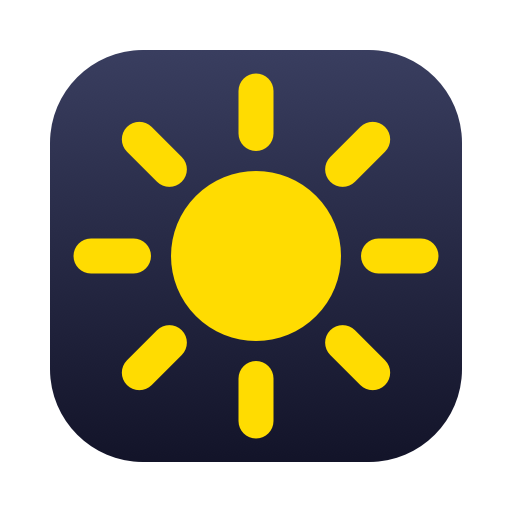

# brightsync



Mirror the built-in display brightness of an Apple Silicon Mac to external
displays over DDC/CI.

Change brightness with the keyboard, Control Center, or let the ambient light
sensor do it - every connected DDC-capable external display follows
immediately. No menu bar app, no polling: the daemon receives the same
notification the system UI uses and pushes the mapped luminance straight to
the display over I2C.

Clamshell mode is covered too: with the lid closed the daemon handles the
brightness keys itself and shows a brightness overlay, so the keys keep
working exactly as they do on the built-in display (see
[Clamshell mode](#clamshell-mode)).

## Install

```sh
brew install --cask pszypowicz/tap/brightsync
```

The cask installs `Brightsync.app` and registers its launch-at-login agent
(SMAppService) - the app appears with its icon under System Settings >
General > Login Items & Extensions. Grant it Accessibility when prompted so
the clamshell brightness keys work.

To build and install from source instead:

```sh
scripts/install-app.sh --sign "<code-signing identity>"
```

Manage launch at login any time with:

```sh
/Applications/Brightsync.app/Contents/MacOS/brightsync --autostart status
```

(`enable` and `disable` likewise.) For a `brightsync` command on your PATH,
symlink the app binary:

```sh
sudo ln -sf /Applications/Brightsync.app/Contents/MacOS/brightsync /usr/local/bin/brightsync
```

The daemon logs to the unified log:

```sh
log stream --predicate 'subsystem == "cz.szypowi.brightsync"'
```

Run `brightsync --verbose` in a terminal instead if you want to watch it
work.

## Usage

```
brightsync                     run in the foreground
brightsync --list              show displays and current values, then exit
brightsync --once              sync once and exit
brightsync --set-external 40   write luminance percent (0-100) to all
                               external displays and exit; the next
                               brightness change re-syncs over it
brightsync --autostart status  launch at login: status, enable, disable
                               (works from the installed app only)
brightsync --help              all flags
```

## Configuration

Flags or `~/.config/brightsync/config.json` (flags win). The service reads
the file at startup; restart it after editing:

```sh
launchctl kickstart -k gui/$UID/cz.szypowi.brightsync
```

```json
{
  "min": 10,
  "max": 100,
  "gamma": 1.4,
  "intervalMs": 50,
  "clamshellKeys": true
}
```

- `min` / `max` - external luminance range (0-100) mapped to internal
  brightness 0..1. Raise `min` if the external display gets too dark at the
  low end.
- `gamma` - curve exponent applied to the internal brightness before mapping.
  Values above 1 keep the external display dimmer in the midrange; below 1
  keep it brighter.
- `intervalMs` - minimum gap between DDC writes. Brightness changes arrive in
  bursts (macOS ramps smoothly), so writes are coalesced to the most recent
  value at this rate. Raise it if your display is flaky under rapid DDC
  traffic.
- `clamshellKeys` - handle the brightness keys while the lid is closed
  (default `true`, see [Clamshell mode](#clamshell-mode)). Set to `false` or
  pass `--no-clamshell-keys` to disable.

## Clamshell mode

With the lid closed the built-in panel goes offline and macOS ignores the
brightness keys. The daemon covers this itself - an event tap picks up the
brightness keys, steps
a virtual brightness through the same mapping curve, writes it to the
external displays, and shows a short-lived overlay: a sun icon that
distinguishes brightening from darkening plus the luminance percentage,
drawn with Liquid Glass on macOS 26. Option+Shift+key gives fine quarter
steps, matching the built-in display. Opening the lid hands the keys
straight back to macOS.

- Requires the Accessibility permission (System Settings > Privacy &
  Security > Accessibility). The daemon prompts on first start and picks the
  grant up the moment it is made; everything else works without it.
- Build from source with a stable code-signing identity
  (`scripts/install-app.sh --sign "<identity>"`, e.g. a Developer ID or a
  self-signed code-signing certificate).
- If a display macOS controls natively is online (Apple Studio Display, Pro
  Display XDR), key presses are passed through even in clamshell so native
  control keeps working.
- The starting value is the last brightness seen before the lid closed; when
  the daemon starts already in clamshell it is derived from the luminance
  the display reports.

## Requirements and limitations

- Apple Silicon and macOS 26 or newer. The DDC transport used here is the
  Apple DCP I2C service; Intel Macs need a different mechanism (see
  [ddcctl](https://github.com/kfix/ddcctl)).
- The display must have DDC/CI enabled (usually an OSD menu setting, on by
  default on most displays).
- Direct HDMI/DisplayPort/USB-C connections work; DisplayLink docks do not
  pass DDC, and some hubs/KVMs are unreliable.
- Apple displays (Studio Display, Pro Display XDR) are controlled natively by
  macOS and are ignored by this tool.
- All external displays receive the same mapped value.
- Uses private macOS APIs (DisplayServices brightness notifications,
  IOAVService I2C), the same ones the popular brightness utilities build on.

## How it works

1. `DisplayServicesRegisterForBrightnessChangeNotifications` (private
   DisplayServices.framework, resolved at runtime) delivers a callback with
   the new built-in brightness whenever it changes, whatever the source.
2. The value is mapped through `min + (max - min) * value^gamma` and scaled to
   the luminance range the display reports.
3. `IOAVServiceWriteI2C` (IOKit) writes the DDC/CI luminance VCP (0x10) to
   every `DCPAVServiceProxy` IORegistry entry located `External`.
4. Display hotplug, sleep/wake, and clamshell transitions trigger a debounced
   re-discovery and re-sync, driven by IOKit notifications: general-interest
   messages from `IOPMrootDomain` (lid state via `AppleClamshellState`, wake
   from sleep) and first-match/terminate events for `DCPAVServiceProxy`
   (display attach/detach).
5. In clamshell mode (no built-in display online) an active CGEvent tap
   captures the brightness key events, a virtual brightness is stepped
   through the same mapping, and the daemon draws a short-lived overlay with
   the step direction and percentage.

## Acknowledgments

The DDC/CI-over-DCP technique comes from
[m1ddc](https://github.com/waydabber/m1ddc), the DisplayServices
notification approach from
[MonitorControl](https://github.com/MonitorControl/MonitorControl) and
[Lunar](https://github.com/alin23/Lunar), and the IOKit lid and hotplug
notification approach from Lunar. If you want a GUI and per-display
control, use those excellent apps instead.

## License

MIT
